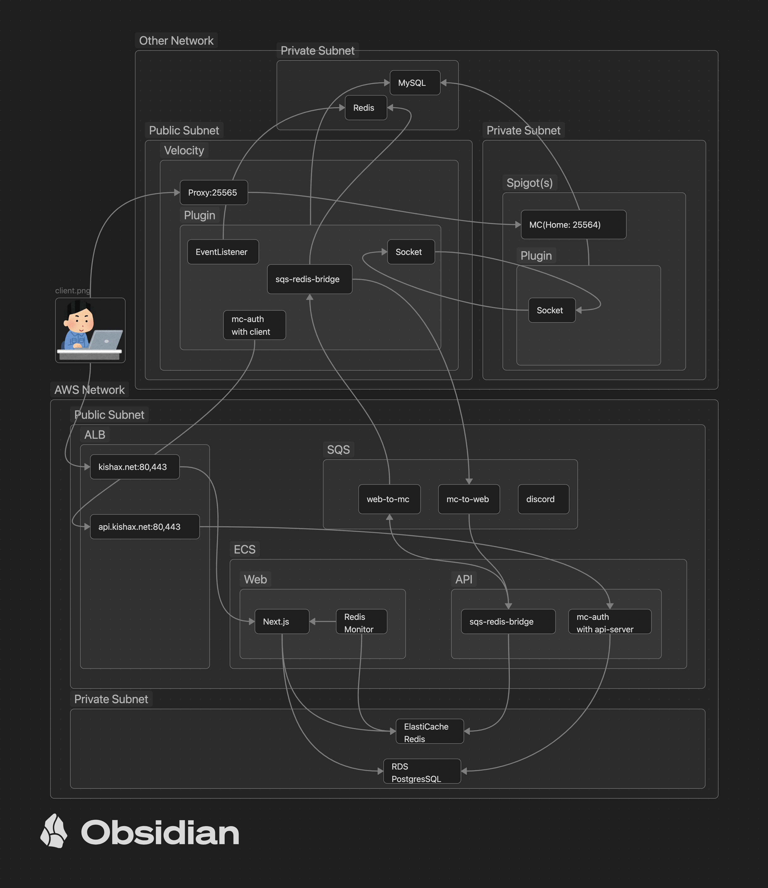

# KishaX Infrastructure

KishaX の統合インフラストラクチャプロジェクト

## Architecture

### ミドルレベルのインフラ(現環境)


### 企業レベルのインフラ(旧環境)


## Tree

```
kishax/
├── apps/                   # アプリケーション層
│   ├── api/               # 共通APIライブラリ (Java)
│   ├── auth/              # カスタムIdP認証サービス (Keycloak/ECS)
│   ├── discord/           # Discord Bot (ECS)
│   ├── mc/                # Minecraft プラグイン (Velocity + Spigot)
│   └── web/               # Web アプリケーション (ECS)
└── aws/                   # AWS共通リソース・ポリシー
```
## Services

このプロジェクトは5つの主要アプリケーションとAWSインフラから構成されています：

- **Auth Service (Keycloak)**: カスタムIdP によるAWS コンソールSSO認証 (Keycloak/ECS)
- **Discord Bot**: MinecraftイベントのDiscord通知 (Java/ECS)
- **Minecraft Plugins**: Velocity/Spigotプラグイン (Java)
- **Web Application**: プレイヤー認証・管理 (Next.js/ECS)

## 開発者向けAWSアクセス

### カスタムIdP (apps/auth) による統合認証

開発メンバーは **Keycloak ベースのカスタムIdP** を通じてAWSコンソールにアクセスします：

**認証フロー**:
```
GitHub OAuth → Keycloak (2FA必須) → AWS IAM Identity Center → AWS Console
```

**アクセス方法**:
1. AWS IAM Identity Center のログインURLにアクセス
2. Keycloak認証画面で GitHub OAuth または Email/Password を選択
3. 2FA認証 (TOTP/Authenticator) を完了
4. AWS Console に自動ログイン

**サポート認証方式**:
- **GitHub OAuth**: GitHubアカウントでのSSO認証
- **Email/Password**: Keycloak ローカル認証 + 2FA

**セキュリティ機能**:
- 全認証方式で2FA (TOTP) 必須
- SAML 2.0 による安全な連携
- ブルートフォース攻撃保護
- GitHub の永続ID を使用したアカウント統合

## MC ↔ Web Communication System

### アーキテクチャ概要

全ての通信は **kishax-api ライブラリ** に統合され、SQS + Redis Pub/Sub によるハイブリッド通信システムを実現しています。

### 通信フロー

**Web → MC (OTP認証・コマンド送信):**
1. Web App → Redis Pub/Sub (`web_to_mc` チャンネル) でリアルタイム送信
2. MC側 SqsWorker が Redis チャンネルを監視して即座に受信
3. Velocity → Spigot にコマンド転送

**MC → Web (レスポンス・イベント通知):**
1. MC Plugins → SQS (`mc-to-web-queue-v2`) 経由で送信
2. Web App が SQS をポーリングしてイベントを受信・処理

**MC → Discord (通知):**
1. MC Plugins → API Gateway (`/discord`) → Lambda → SQS (`discord-queue-v2`)
2. Discord Bot が SQS をポーリングして通知を送信

### OTP認証フロー

1. **Web**: ユーザーがOTP認証リクエスト → Redis Pub/Sub で `web_mc_otp` メッセージ送信
2. **MC**: SqsWorker が Redis チャンネルを監視して受信 → Velocity で OTP 表示
3. **MC**: プレイヤーがOTP入力 → SQS経由で `mc_web_otp_response` を Web に送信
4. **Web**: OTP検証完了 → 認証成功/失敗をレスポンス

### kishax-api 統合

- **SqsWorker**: SQS + Redis Pub/Sub を統合したメッセージハンドラ
- **QUEUE_MODE**: `WEB` または `MC` でメッセージ送受信方向を制御
- **コールバック統合**: Java プラグインシステムとシームレス連携

### メッセージタイプ

**Web → MC:**
- `web_mc_otp`: OTP認証要求
- `web_mc_auth_confirm`: プレイヤー認証確認
- `web_mc_teleport`: テレポートコマンド
- `web_mc_server_switch`: サーバー切り替え
- `web_mc_message`: メッセージ送信

**MC → Web:**
- `mc_web_otp_response`: OTP認証レスポンス
- `mc_web_auth_response`: 認証レスポンス
- `mc_web_player_status`: プレイヤーステータス変更
- `mc_web_server_info`: サーバー情報更新

### AWS リソース

**SQS キュー:**
- `kishax-web-to-mc-queue-v2` + DLQ (Web→MC通信用)
- `kishax-mc-to-web-queue-v2` + DLQ (MC→Web通信用) 
- `kishax-discord-queue-v2` + DLQ (Discord Bot用)

## QuickStart

### First Setup
```bash
make setup-first-time
make setup-prerequisites
```

### Deploy
```bash
# 全サービスデプロイ
make deploy-all

# 個別サービスデプロイ  
make deploy-discord
make deploy-web
```

## Infrastructure Summary

### ECS Services (Fargate)
- **API Service**: `kishax-api-service-v2` (256CPU/512MB)
- **Auth Service**: `kishax-auth-service-v2` (512CPU/1024MB)
- **Discord Bot**: `kishax-discord-bot-service-v2` (256CPU/512MB)
- **Web App**: `kishax-web-service-v2` (1024CPU/2048MB)

### Networking
- **ALB**: `kishax-alb-v2` (Internet-facing)
- **Target Group**: `kishax-web-tg-v2` (Health check: `/api/health`)
- **Security Groups**: ECS用とALB用で分離
- **SSL**: HTTPS強制リダイレクト対応

### Monitoring & Logging
- **CloudWatch Logs**: 各サービス毎に分離 (30日保持)
- **SQS DLQ**: 最大3回リトライ後にDead Letter Queueへ

### Configuration Management
- **SSM Parameter Store**: 全ての機密情報を暗号化保存
  - `/kishax/discord/*` - Discord Bot設定
  - `/kishax/web/*` - Web アプリ設定  
  - `/kishax/sqs/*` - SQS関連設定
  - `/kishax/slack/*` - Slack通知設定
  - `/kishax/redis/*` - Redis接続情報
  - `/kishax/mc/*` - MC プラグイン設定

### 新環境変数 (kishax-api統合)
- **QUEUE_MODE**: `WEB` または `MC` でメッセージ方向制御
- **REDIS_URL**: Redis Pub/Sub 接続URL
- **WEB_API_KEY**: Web ↔ MC 通信認証キー
- **MC_REDIS_URL**: MC用Redis接続URL（必要に応じて）

---

**Last Update**: 2025-09-13
