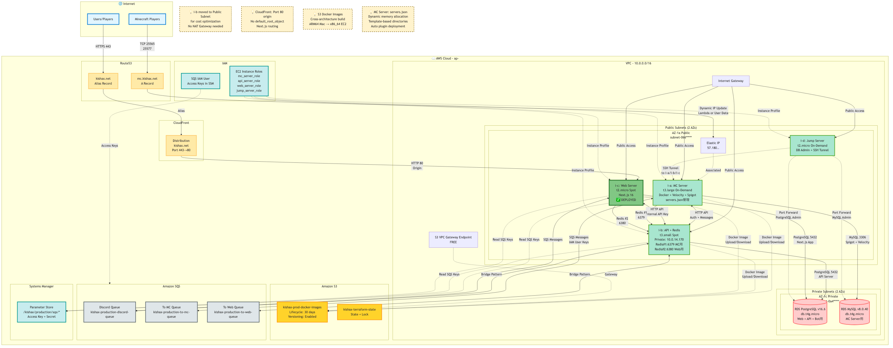
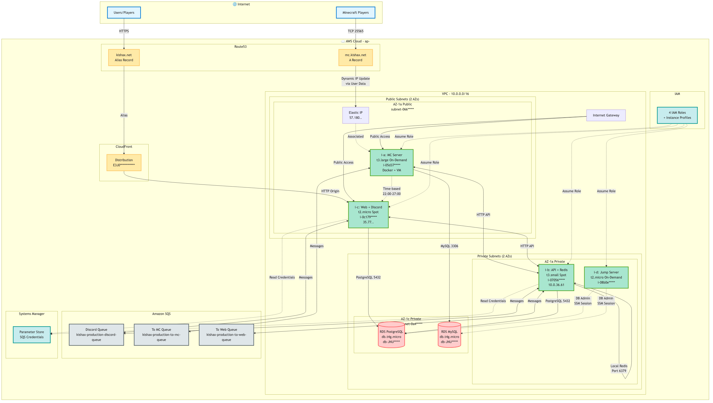

# KishaX Infrastructure

KishaX の統合インフラストラクチャプロジェクト

## Architecture

### 最新インフラ構成 (EC2ベース - 2025/12更新)


### 前世代インフラ構成 (EC2移行前)


### レガシー環境 (ECS/Fargate)


## 📋 Project Structure

```
kishax/
├── apps/                   # アプリケーション層 (Git Submodules)
│   ├── api/               # 共通APIサーバー (Java + Spring Boot)
│   │   ├── compose.yaml   # Redis + SQS Bridge + API + Discord Bot
│   │   └── Dockerfile*    # 各サービス用Dockerfile
│   ├── mc/                # Minecraft Server (Velocity + Spigot)
│   │   ├── compose.yml    # MC Server + MySQL
│   │   ├── Dockerfile     # Multi-stage build
│   │   └── docker/
│   │       ├── config/servers.json        # サーバー構成定義
│   │       ├── database/                  # DB関連
│   │       ├── scripts/                   # 起動・管理スクリプト
│   │       └── templates/                 # 設定テンプレート
│   └── web/               # Web アプリケーション (Next.js 16)
│       ├── compose.yaml   # Next.js App
│       └── Dockerfile     # Standalone build
│
├── terraform/             # Infrastructure as Code
│   ├── main.tf           # メイン構成
│   ├── modules/          # 再利用可能モジュール
│   │   ├── vpc/          # VPC, Subnets, IGW, S3 Endpoint
│   │   ├── ec2/          # 4 EC2 Instances
│   │   ├── rds/          # PostgreSQL + MySQL
│   │   ├── sqs/          # 3 Queues + DLQs
│   │   ├── s3/           # Docker Images bucket
│   │   ├── cloudfront/   # CDN
│   │   ├── route53/      # DNS
│   │   ├── iam/          # Roles + Policies
│   │   └── security_groups/ # Security Groups
│   └── terraform.tfvars  # 環境変数
│
└── docs/infrastructure/ec2/  # ドキュメント
    ├── deployment.md         # デプロイメントガイド
    ├── architecture.md       # アーキテクチャ詳細
    ├── mc-requirements.md    # MC Server要件
    └── next-challenge.md     # 今後の改善案
```

## 🏗️ Infrastructure Overview

### EC2 Instances (4台構成)

| Instance | Type | Role | Subnet | Cost Optimization |
|----------|------|------|--------|-------------------|
| **i-a** | t3.large On-Demand | MC Server | Public | 24/7運用 |
| **i-b** | t3.small Spot | API + Redis | **Public** | NAT不要で¥5,000削減 |
| **i-c** | t2.micro Spot | Web Server | Public | ✅ Deployed |
| **i-d** | t2.micro On-Demand | Jump Server | Public | 必要時のみ起動 |

**コスト最適化の判断**:
- i-b を Public に配置することで **NAT Gateway (¥5,000/月)** を削減
- Discord API, Docker Hub へのアクセスのためインターネット接続が必要
- 目標月額: **¥5,000-6,000** 達成

### Databases (RDS)

| Database | Engine | Instance | Purpose |
|----------|--------|----------|---------|
| PostgreSQL | v16.6 | db.t4g.micro | Web + API + Discord Bot |
| MySQL | v8.0.40 | db.t4g.micro | Minecraft Server |

### Storage

| Service | Bucket/Table | Purpose |
|---------|--------------|---------|
| S3 | kishax-prod-docker-images | Docker Image保存 (30日ライフサイクル) |
| S3 | kishax-terraform-state | Terraform状態管理 |
| DynamoDB | kishax-terraform-locks | Terraform State Lock |

### Messaging & Queues

| Queue | Purpose | Connected Services |
|-------|---------|-------------------|
| to-mc-queue | Web → MC通信 | i-a, i-c |
| to-web-queue | MC → Web通信 | i-a, i-c |
| discord-queue | Discord通知 | i-a, i-b, i-c |

**SQS認証**: IAM Userのアクセスキー（SSM Parameter Storeに保管）

### Content Delivery

- **CloudFront**: kishax.net (HTTPS)
  - Origin: i-c (Port 80)
  - ACM証明書: *.kishax.net
  - キャッシュ最適化

## 🎮 MC Server: servers.json管理システム

### 特徴

MC Serverは`apps/mc/docker/config/servers.json`による**完全自動化システム**を採用：

1. **動的メモリ配分**: OVERALL_MEMORYから自動計算
2. **複数Spigotサーバー対応**: memory_ratioで有効/無効
3. **プラグインプリセット**: preset/customで柔軟に管理
4. **自動設定生成**: velocity.toml, velocity-kishax-config.ymlを自動生成
5. **DB自動登録**: statusテーブルにサーバー情報を自動登録

### servers.json 構造

```json
{
  "memory": { "overall": "8.0", "buffer": 0.1, "mc_wantage": 1.0 },
  "plugin_presets": { "essential": [...], "full": [...] },
  "proxies": [{ "name": "velocity-main", "memory_ratio": 0.1, ... }],
  "spigots": [{ 
    "name": "spigot-main", 
    "memory_ratio": 0.9,
    "is_home": true,
    "minecraft_version": "1.21.8",
    "kishax_spigot_jar": "Kishax-Spigot-1.21.8.jar",
    ...
  }],
  "plugins": { ... }
}
```

### メモリ計算式

```
MC全体メモリ (O-MC) = (OVERALL_MEMORY - Buffer) × mc_wantage
各サーバーメモリ = O-MC × memory_ratio + (残りメモリ / サーバー数)
```

### 自動化スクリプト

| Script | Purpose |
|--------|---------|
| setup-directories.sh | テンプレートからディレクトリ生成 |
| calculate-memory.sh | メモリ自動計算 |
| generate-velocity-config.sh | Velocity設定自動生成 |
| deploy-plugins.sh | プラグイン自動配置 |
| register-servers-to-db.sh | statusテーブル自動登録 |

## 🌐 Web Application (i-c) - ✅ Deployed

### Tech Stack

- **Framework**: Next.js 16 (App Router)
- **Auth**: next-auth v5.0.0-beta.30
- **Database**: Prisma + PostgreSQL
- **Redis**: ioredis (i-b:6380)

### Deployment

- **ビルド方法**: ローカルビルド (ARM64 Mac → x86_64 EC2)
- **転送方法**: S3経由 (SSH転送は遅いため)
- **実行**: Docker Compose (pre-built image)
- **公開**: CloudFront経由 (HTTPS)

### 環境変数管理

- `SEED_ENV=production`: 本番環境でシード投入スキップ
- `DATABASE_URL`: URL encoding必須 (`#` → `%23`, `$` → `%24`)
- `REDIS_URL`: i-bのプライベートIP使用
- `INTERNAL_API_KEY`: openssl生成の32 byte hex

## 🔐 Security

### IAM Roles (Least Privilege)

- **mc_server_role**: SQS, S3, CloudWatch, SSM
- **api_server_role**: SQS, S3, CloudWatch, SSM
- **web_server_role**: SQS, S3, CloudWatch, SSM
- **jump_server_role**: SSM Session Manager

### Security Groups

- **i-a**: 25565, 25577 (MC), 22 (SSH from Jump)
- **i-b**: 8080 (API from i-a/i-c), 6379 (Redis from i-a), 6380 (Redis from i-c), 22 (SSH from Jump)
- **i-c**: 80 (HTTP), 22 (SSH from Jump)
- **i-d**: SSM only (no inbound)

### Access Methods

- **Jump Server経由**: SSM Session Manager + Port Forwarding
- **RDS接続**: Jump Server経由のポートフォワーディング
- **EC2アクセス**: Jump Server経由のSSHトンネル

## 🚀 Deployment

### Prerequisites

```bash
# AWS SSO ログイン
make login

# Terraform初期化
cd terraform
terraform init
terraform plan
terraform apply
```

### デプロイ順序

```
1. i-b (API Server + Redis) ← 他が依存
   ↓
2. i-c (Web Server)         ← i-bのRedis/APIに依存 ✅
   ↓
3. i-a (MC Server)          ← i-bのRedis/APIに依存
```

詳細は [`docs/infrastructure/ec2/deployment.md`](docs/infrastructure/ec2/deployment.md) を参照。

## 📊 Cost Estimate

| Resource | Spec | Monthly Cost (JPY) |
|----------|------|--------------------|
| i-a (MC) | t3.large On-Demand | ¥2,500 |
| i-b (API) | t3.small Spot | ¥500 |
| i-c (Web) | t2.micro Spot | ¥200 |
| i-d (Jump) | t2.micro On-Demand | ¥300 (時間課金) |
| RDS PostgreSQL | db.t4g.micro | ¥1,200 |
| RDS MySQL | db.t4g.micro | ¥1,200 |
| CloudFront | CDN + HTTPS | ¥300 |
| S3 + その他 | Storage + Transfer | ¥300 |
| **合計** | | **¥5,500-6,500/月** |

## 📚 Documentation

- [Deployment Guide](docs/infrastructure/ec2/deployment.md) - 詳細デプロイ手順
- [Architecture Details](docs/infrastructure/ec2/architecture.md) - アーキテクチャ詳細
- [MC Requirements](docs/infrastructure/ec2/mc-requirements.md) - MC Server要件
- [Next Challenges](docs/infrastructure/ec2/next-challenge.md) - 今後の改善案

## 🔄 Recent Updates

### 2025-12-14
- ✅ i-c (Web Server) デプロイ完了
- ✅ MC Server: servers.json動的管理システム実装
- ✅ ディレクトリ構造リファクタリング完了
- ✅ S3 Docker Images導入（クロスアーキテクチャビルド対応）
- ✅ CloudFront設定修正（Next.js routing対応）

### 2025-12-12
- ✅ i-b を Public Subnet に移動（コスト最適化）
- ✅ Security Group整理（Redis専用ポート分離）
- ✅ S3 VPC Gateway Endpoint追加

---

**Maintained by**: Kishax Development Team  
**Last Update**: 2025-12-14
