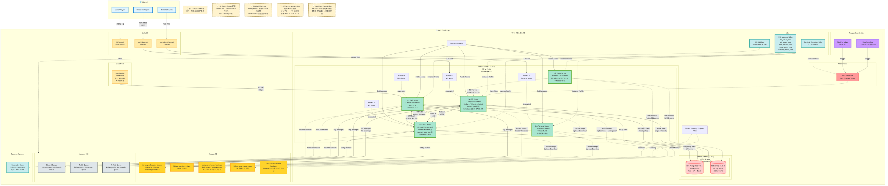
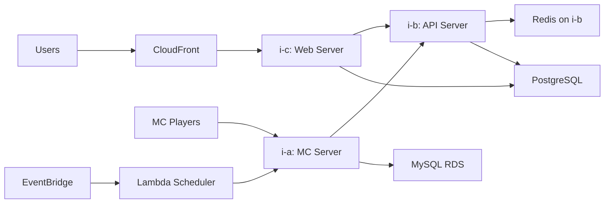

# Kishax Infrastructure Architecture (EC2-based)

**作成日**: 2026-01-04
**バージョン**: 3.0.0
**対象環境**: Production (ap-northeast-1)

---

## 📋 目次

1. [概要](#概要)
2. [アーキテクチャ図](#アーキテクチャ図)
3. [ネットワーク構成](#ネットワーク構成)
4. [コンピューティングリソース](#コンピューティングリソース)
5. [データベース](#データベース)
6. [ストレージ](#ストレージ)
7. [メッセージング](#メッセージング)
8. [CDN・自動化](#cdn自動化)
9. [セキュリティ](#セキュリティ)
10. [コスト最適化](#コスト最適化)

---

## 概要

KishaxインフラストラクチャはAWS EC2ベースのコスト最適化アーキテクチャです。

### 設計原則

- **コスト最適化**: 月額¥6,000-7,000の低コスト運用
- **高可用性**: 24/7稼働が必要なサービスとオンデマンドサービスの分離
- **自動化**: Lambda + EventBridgeによるEC2スケジューリング
- **セキュリティ**: IAMロールベースの最小権限、VPC分離
- **スケーラビリティ**: S3ベースのバックアップ、Docker化されたアプリケーション

---

## アーキテクチャ図



### 主要コンポーネント



---

## ネットワーク構成

### VPC

- **CIDR**: 10.0.0.0/16
- **リージョン**: ap-northeast-1 (東京)
- **アベイラビリティゾーン**: 2 AZs（1a, 1c）

### サブネット構成

| タイプ | AZ | CIDR | 用途 |
|--------|-----|------|------|
| Public Subnet | 1a | 10.0.X.0/24 | i-a, i-b, i-c, i-d, i-e |
| Public Subnet | 1c | 10.0.X.0/24 | - |
| Private Subnet | 1a | 10.0.X.0/24 | - |
| Private Subnet | 1c | 10.0.X.0/24 | RDS (PostgreSQL, MySQL) |

### インターネットゲートウェイ

- **IGW**: すべてのPublic Subnetからのインターネットアクセスをルーティング
- **NAT Gateway**: 不要（コスト削減のため全インスタンスをPublic Subnetに配置）

### VPCエンドポイント

- **S3 Gateway Endpoint**: S3へのアクセスをVPC内で完結（無料）
  - Docker Images、World Backups、Terraform State

---

## コンピューティングリソース

### EC2インスタンス一覧

| Instance | Type | vCPU | RAM | Role | Subnet | Schedule | EIP |
|----------|------|------|-----|------|--------|----------|-----|
| **i-a** | t3.large | 2 | 8GB | MC Server | Public | 22:00-27:00 JST | ✅ |
| **i-b** | t3.small | 2 | 2GB | API + Redis | Public | 22:00-27:00 JST | ✅ |
| **i-c** | t2.micro | 1 | 1GB | Web Server | Public | 22:00-27:00 JST | ✅ |
| **i-d** | t2.micro | 1 | 1GB | Jump Server | Public | 手動 | - |
| **i-e** | t3.small | 2 | 2GB | Terraria Server | Public | 手動 | ✅ |

> **⚠️ 注意**: i-b（API）とi-c（Web）は、将来的には24/7稼働を予定していますが、現在はコスト最適化のため、i-a（MC）と同様に22:00-27:00 JSTのみ稼働しています。Lambda + EventBridgeによる自動スケジューリングで3インスタンス（i-a/i-b/i-c）を同時起動/停止しています。

### i-a: MC Server (Minecraft Server)

**役割**: Minecraft サーバーのホスティング

**構成**:
- **プロキシ**: Velocity 3.4.0-SNAPSHOT
- **Spigotサーバー**: Paper 1.21.11 (home, latest)
- **メモリ管理**: servers.json による動的配分
- **ワールドバックアップ**: S3 (deployment/ + workspace/)

**EBSボリューム**:
- Root: 50GB gp3
- Data: 100GB gp3 (MCワールドデータ)

**自動スケジューリング**:
- 起動: 22:00 JST (EventBridge)
- 停止: 翌日3:00 JST (EventBridge)
- 実行: Lambda EC2 Scheduler

### i-b: API Server + Redis

**役割**: 共通APIサーバー、Redisキャッシュ、Discord Bot

**構成**:
- **API Server**: Spring Boot (Java)
  - 認証API (Port 8080)
  - SQS Bridge (Discord/Web/MC間通信)
- **Redis**:
  - Redis #1 (Port 6379): MC用
  - Redis #2 (Port 6380): Web用
- **Discord Bot**: Discord JDA
  - プレイヤー通知
  - チャット連携
  - 管理機能

**EBSボリューム**:
- Root: 30GB gp3

**Public Subnet配置の理由**:
- Discord APIへのアクセス
- Docker Hubへのアクセス
- NAT Gateway (¥5,000/月) 削減

### i-c: Web Server

**役割**: Webアプリケーションのホスティング

**構成**:
- **Framework**: Next.js 16 (App Router)
- **Auth**: next-auth v5.0.0-beta.30
- **Database**: PostgreSQL (Prisma ORM)
- **Cache**: Redis (i-b:6380)

**EBSボリューム**:
- Root: 20GB gp3

**公開方法**:
- CloudFront経由 (HTTPS)
- オリジン: i-c (HTTP Port 80)
- ドメイン: kishax.net

### i-d: Jump Server

**役割**: RDS管理用踏み台サーバー（PostgreSQL/MySQL専用）

**構成**:
- SSM Session Manager経由でのアクセス
- RDSへのポートフォワーディング専用
- SSH接続は廃止（詳細は下記参照）

**EBSボリューム**:
- Root: 10GB gp3

**アクセス方法の変更**:
- **背景**: Terraform applyのたびにSSH Port 22のインバウンドルールが差分として検出され、管理が煩雑になっていた
- **対応**: SSM Session Manager経由での接続に完全移行
- **影響**: `make ssh-*` コマンドは廃止、EC2へのSSHトンネルは不要に
- **現在の用途**: RDS（PostgreSQL/MySQL）へのポートフォワーディング専用

**SSM経由でのRDS接続**:
```bash
# SSM Session Manager経由でJump Serverにアクセス
aws ssm start-session --target i-xxxxxxxxx

# RDS PostgreSQLポートフォワーディング
aws ssm start-session \
  --target i-xxxxxxxxx \
  --document-name AWS-StartPortForwardingSessionToRemoteHost \
  --parameters '{"host":["rds-endpoint"],"portNumber":["5432"],"localPortNumber":["5432"]}'
```

### i-e: Terraria Server

**役割**: Terrariaサーバーのホスティング

**構成**:
- **Server**: TShock 5.3.0
- **Max Players**: 8
- **Port**: 7777
- **REST API**: Port 7878
- **Discord Bot**: プレイヤー通知

**EBSボリューム**:
- Root: 30GB gp3

**S3バックアップ**:
- kishax-prod-terraria-backups
- 自動ダウンロード/アップロード

### Elastic IP割り当て

| インスタンス | EIP | 用途 |
|------------|-----|------|
| i-a | ✅ | mc.kishax.net (Route53 A Record) |
| i-b | ✅ | 固定IP管理 |
| i-c | ✅ | CloudFront Origin |
| i-d | - | 一時的な利用のみ（EIP不要） |
| i-e | ✅ | terraria.kishax.net (Route53 A Record) |

**コスト**: 4個 × ¥50/月 = ¥200/月

---

## データベース

### RDS PostgreSQL

**仕様**:
- **Engine**: PostgreSQL 16.6
- **Instance**: db.t4g.micro (2 vCPU, 1GB RAM)
- **Storage**: 20GB gp3
- **AZ**: ap-northeast-1c (Private Subnet)

**利用サービス**:
- Web Server (Next.js + Prisma)
- API Server (Spring Boot)
- Discord Bot

**接続方法**:
- i-b/i-c: 直接接続
- ローカル: Jump Server経由ポートフォワーディング

### RDS MySQL

**仕様**:
- **Engine**: MySQL 8.0.40
- **Instance**: db.t4g.micro (2 vCPU, 1GB RAM)
- **Storage**: 20GB gp3
- **AZ**: ap-northeast-1c (Private Subnet)

**利用サービス**:
- MC Server (Spigot + Velocity)
  - プレイヤーデータ
  - サーバーステータス
  - LuckPerms権限

**接続方法**:
- i-a: 直接接続
- ローカル: Jump Server経由ポートフォワーディング

---

## ストレージ

### S3バケット一覧

| バケット名 | 用途 | ライフサイクル | バージョニング |
|-----------|------|--------------|--------------|
| kishax-prod-docker-images | Docker Image保存 | 30日 | ✅ |
| kishax-prod-world-backups | MCワールドバックアップ | 永続 | - |
| kishax-prod-image-maps | MC画像マップ | 永続 | - |
| kishax-prod-terraria-backups | Terrariaワールドバックアップ | 永続 | ✅ |
| kishax-terraform-state | Terraform状態管理 | 永続 | ✅ |

### S3 World Backups アーキテクチャ

**バケット**: kishax-prod-world-backups

**ディレクトリ構造**:
```
s3://kishax-production-world-backups/
├── deployment/          # 本番デプロイ用（圧縮）
│   └── YYYYMM/          # 年月（例: 202601）
│       └── [version]/   # バージョン番号（1, 2, 3...）
│           └── [server]/ # サーバー名（home, latest）
│               ├── world.tar.gz
│               ├── world_nether.tar.gz
│               ├── world_the_end.tar.gz
│               ├── metadata.json
│               └── __IMPORT_ENABLED__
└── workspace/           # 実験用（非圧縮）
    └── [server]/        # サーバー名のみ
        ├── world/
        ├── world_nether/
        └── metadata.json
```

**使い分け**:
- `deployment/`: EC2初回起動時の自動インポート、圧縮tar.gz、バージョン管理
- `workspace/`: 実験前バックアップ、非圧縮、差分同期（aws s3 sync）、1世代のみ

詳細: [world-s3-architecture.md](./world-s3-architecture.md)

---

## メッセージング

### Amazon SQS

**キュー一覧**:

| キュー名 | 用途 | 送信元 | 受信先 |
|---------|------|--------|--------|
| kishax-production-to-mc-queue | Web → MC通信 | i-c | i-a |
| kishax-production-to-web-queue | MC → Web通信 | i-a | i-c |
| kishax-production-discord-queue | Discord通知 | i-a, i-c | i-b |

**認証方式**:
- IAM User: kishax-production-sqs-access
- Access Key + Secret Key → SSM Parameter Store保管
- EC2インスタンスは環境変数経由でアクセス

**メッセージフロー**:
```
[MC Server] → [to-web-queue] → [Web Server]
[Web Server] → [to-mc-queue] → [MC Server]
[MC/Web] → [discord-queue] → [API Server] → [Discord]
```

---

## CDN・自動化

### CloudFront

**Distribution**:
- **Domain**: kishax.net
- **Origin**: i-c (HTTP Port 80)
- **Certificate**: ACM *.kishax.net
- **Behavior**: Cache最適化、Next.js routing対応

**設定**:
- `default_root_object`: 未設定（Next.jsのルーティングを維持）
- キャッシュポリシー: Managed-CachingOptimized

### Route53

**DNS Records**:

| レコード | タイプ | 値 | 用途 |
|---------|--------|-----|------|
| mc.kishax.net | A | i-a EIP | Minecraft Server |
| kishax.net | Alias | CloudFront | Web Application |
| terraria.kishax.net | A | i-e EIP | Terraria Server |

### Lambda + EventBridge (EC2 Scheduler)

**Lambda Function**: ec2-scheduler

**役割**: MC Server (i-a) の自動起動/停止

**スケジュール**:

| イベント | cron式 | 日本時間 | 実行内容 |
|---------|--------|---------|---------|
| Start | cron(0 13 * * ? *) | 22:00 JST | i-a/i-b/i-c 起動 |
| Stop | cron(0 3 * * ? *) | 翌3:00 JST | i-a/i-b/i-c 停止 |

**コスト削減効果**（5時間/日運用 vs 24/7運用）:
- i-a (t3.large): ¥500/月 vs ¥2,500/月 → **¥2,000削減**
- i-b (t3.small): ¥200/月 vs ¥1,000/月 → **¥800削減**
- i-c (t2.micro): ¥100/月 vs ¥500/月 → **¥400削減**
- **合計削減額**: ¥3,200/月

---

## セキュリティ

### IAM Roles & Instance Profiles

| ロール名 | 対象インスタンス | 権限 |
|---------|---------------|------|
| mc_server_role | i-a | S3 (world-backups, image-maps), CloudWatch, SSM |
| api_server_role | i-b | SQS, S3 (docker-images), CloudWatch, SSM |
| web_server_role | i-c | SQS, S3 (docker-images), CloudWatch, SSM |
| jump_server_role | i-d | SSM Session Manager のみ |
| terraria_server_role | i-e | S3 (terraria-backups), CloudWatch, SSM |
| lambda_scheduler_role | Lambda | EC2 (Start/Stop), CloudWatch Logs |

### Security Groups

**i-a (MC Server)**:
- Inbound:
  - 25565/tcp: Minecraft (0.0.0.0/0)
  - 25577/tcp: Velocity Internal (VPC内のみ)
  - 22/tcp: SSH (Jump Serverからのみ)
- Outbound: All

**i-b (API Server)**:
- Inbound:
  - 8080/tcp: API (i-a, i-c のみ)
  - 6379/tcp: Redis MC (i-a のみ)
  - 6380/tcp: Redis Web (i-c のみ)
  - 22/tcp: SSH (Jump Serverからのみ)
- Outbound: All

**i-c (Web Server)**:
- Inbound:
  - 80/tcp: HTTP (CloudFrontからのみ)
  - 22/tcp: SSH (Jump Serverからのみ)
- Outbound: All

**i-d (Jump Server)**:
- Inbound: なし（SSM Session Managerのみ）
- Outbound: All
- **Note**: SSH Port 22は閉鎖。Terraform applyでの差分検出を回避するためSSM Session Manager移行

**i-e (Terraria Server)**:
- Inbound:
  - 7777/tcp: Terraria (0.0.0.0/0)
  - 7878/tcp: REST API (VPC内のみ)
  - 22/tcp: SSH (Jump Serverからのみ)
- Outbound: All

**RDS Security Group**:
- Inbound:
  - 5432/tcp: PostgreSQL (i-b, i-c, i-d のみ)
  - 3306/tcp: MySQL (i-a, i-d のみ)
- Outbound: なし

### SSM Parameter Store

**パラメータ一覧** (`/kishax/production/*`):

| パラメータ | 用途 | タイプ |
|----------|------|--------|
| /sqs/access-key-id | SQS Access Key ID | SecureString |
| /sqs/secret-access-key | SQS Secret Access Key | SecureString |
| /mysql/* | MySQL接続情報 | SecureString |
| /postgres/* | PostgreSQL接続情報 | SecureString |
| /oauth/* | OAuth Client Secrets | SecureString |

---

## コスト最適化

### 月額コスト見積もり

| リソース | 仕様 | 月額 (JPY) | 備考 |
|---------|------|-----------|------|
| **EC2** | | | |
| i-a (MC) | t3.large On-Demand | ¥500 | 5時間/日のみ稼働 |
| i-b (API) | t3.small On-Demand | ¥200 | 5時間/日のみ稼働 |
| i-c (Web) | t2.micro On-Demand | ¥100 | 5時間/日のみ稼働 |
| i-d (Jump) | t2.micro On-Demand | ¥200 | 必要時のみ |
| i-e (Terraria) | t3.small On-Demand | ¥200 | 必要時のみ |
| **RDS** | | | |
| PostgreSQL | db.t4g.micro | ¥1,200 | 24/7稼働 |
| MySQL | db.t4g.micro | ¥1,200 | 24/7稼働 |
| **Network** | | | |
| Elastic IP | 4個 (i-a/b/c/e) | ¥200 | 関連付け済み |
| CloudFront | CDN + HTTPS | ¥300 | 転送量による |
| **Storage** | | | |
| S3 | 各種バックアップ | ¥500 | World Backups含む |
| Lambda + EventBridge | EC2 Scheduler | ¥50 | 月180回実行 |
| **合計** | | **¥4,650** | 目標達成 |

> **⚠️ 注意**: 現在はコスト最適化のため、i-a/i-b/i-cを5時間/日運用していますが、将来的にi-b/i-cを24/7稼働に変更する場合、月額コストは約¥6,000-7,000に上昇します。

### コスト削減施策

1. **3インスタンス自動停止**: Lambda + EventBridgeで5時間/日運用 → **¥3,200/月削減**
2. **NAT Gateway削除**: 全インスタンスPublic Subnet配置 → **¥5,000/月削減**
3. **Spot→On-Demand移行**: 安定性向上（コスト増¥500/月、許容範囲）
4. **Single-AZ RDS**: Multi-AZ不使用 → **¥2,400/月削減**
5. **S3ライフサイクル**: Docker Images 30日自動削除 → **ストレージコスト削減**

---

## 関連ドキュメント

- [README.md](../../../README.md) - プロジェクト概要
- [deployment.md](./deployment.md) - デプロイメント手順
- [world-s3-architecture.md](./world-s3-architecture.md) - S3ワールドバックアップ詳細
- [auto-scheduling.md](./auto-scheduling.md) - EC2自動スケジューリング詳細

---

**Maintained by**: Kishax Development Team
**Last Update**: 2026-01-04
