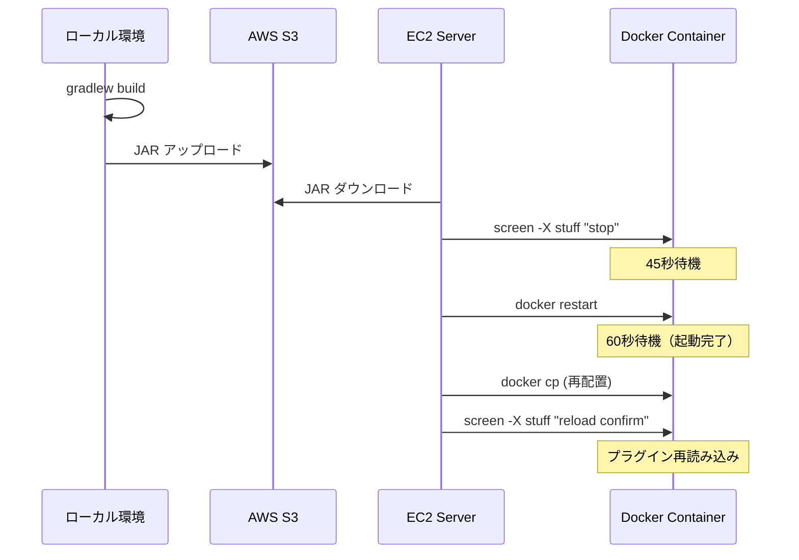

# Minecraftプラグインのディレクトリ構造とデプロイメント

## 概要

このドキュメントは、KishaxのMinecraftサーバー（Docker環境）におけるプラグインのディレクトリ構造とデプロイメントプロセスを説明します。

## Dockerコンテナ内のディレクトリ構造

```
/mc/
├── velocity/               # Velocity（プロキシサーバー）
│   ├── plugins/           # Velocityプラグイン配置先
│   │   └── Kishax-Velocity-3.4.0.jar
│   └── logs/
│       └── latest.log
│
├── spigot/                # Spigotサーバー用ディレクトリ
│   ├── home/              # Homeサーバー（1.21.11）
│   │   ├── plugins/       # プラグイン配置先
│   │   │   └── Kishax-Spigot-1.21.11.jar
│   │   └── logs/
│   │       └── latest.log
│   │
│   └── latest/            # Latestサーバー（1.21.11）
│       ├── plugins/       # プラグイン配置先
│       │   └── Kishax-Spigot-1.21.11.jar
│       └── logs/
│           └── latest.log
│
├── server/                # 旧ディレクトリ（使用されていない）
│   └── plugins/           # ⚠️ このパスは存在しない
│
└── start.sh               # コンテナ起動スクリプト
```

## 重要な注意点

### 1. プラグイン配置パス

**正しいパス:**
- Velocity: `/mc/velocity/plugins/`
- Spigot Home: `/mc/spigot/home/plugins/`
- Spigot Latest: `/mc/spigot/latest/plugins/`

**間違ったパス（存在しない）:**
- `/mc/server/plugins/` ❌

### 2. Docker起動時の動作

Dockerコンテナの起動時（`docker restart` 実行時）に以下が発生する可能性があります：

1. **プラグインの再配置**: 初期化スクリプトがプラグインディレクトリを再生成する
2. **古いプラグインの復元**: S3やローカルストレージから古いプラグインがダウンロードされる
3. **設定ファイルの再生成**: テンプレートから設定ファイルが再生成される

このため、**Docker再起動後に再度プラグインをコピー**する必要があります。

## デプロイメントプロセス

### 1. ローカルでビルド&S3アップロード

```bash
cd apps/mc
make deploy-mc-to-s3
```

**実行内容:**
1. `./gradlew clean build -x test` でビルド
2. S3バケット `kishax-production-docker-images/mc-plugins/` にアップロード

### 2. EC2でデプロイ

```bash
cd /opt/mc
make deploy-mc
```

**実行内容:**
1. S3から最新のJARをダウンロード
2. 各サーバーに `stop` / `end` コマンドを送信
3. 45秒待機（サーバー停止）
4. `docker restart kishax-minecraft` でコンテナ再起動
5. **60秒待機（Docker起動完了）** ← 重要！
6. **再度プラグインをコピー** ← Docker起動後の上書き対策
7. Spigotサーバーで `reload confirm` を実行
8. 一時ファイルを削除

### 3. デプロイフロー図



## トラブルシューティング

### 問題: デプロイ後も古いプラグインがロードされる

**原因:**
- Docker起動時のスクリプトが古いプラグインで上書きしている
- プラグインのコピータイミングが早すぎる

**解決策:**
1. Docker再起動後、十分な待機時間（60秒）を設ける
2. Docker起動完了後に再度プラグインをコピー
3. Spigotサーバーで `reload confirm` を実行

### 問題: ビルド識別子がログに表示されない

**確認方法:**

```bash
# ローカルJARの内容確認
cd apps/mc
unzip -p spigot/sv1_21_11/build/libs/Kishax-Spigot-1.21.11.jar \
  net/kishax/mc/spigot/Main.class | strings | grep "v1.0.0"

# Docker内のJARの内容確認
docker exec kishax-minecraft unzip -p \
  /mc/spigot/home/plugins/Kishax-Spigot-1.21.11.jar \
  net/kishax/mc/spigot/Main.class | strings | grep "v1.0.0"
```

**期待される出力:**
```
v1.0.0-20251221-2130
```

### 問題: プラグインが配置されていない

**確認方法:**

```bash
# Velocityプラグイン確認
docker exec kishax-minecraft ls -la /mc/velocity/plugins/ | grep Kishax

# Spigotプラグイン確認
docker exec kishax-minecraft ls -la /mc/spigot/home/plugins/ | grep Kishax
docker exec kishax-minecraft ls -la /mc/spigot/latest/plugins/ | grep Kishax
```

**期待される出力:**
```
-rw-rw-r--  1 ubuntu ubuntu 31228670 Dec 27 18:23 Kishax-Velocity-3.4.0.jar
-rw-rw-r--  1 ubuntu ubuntu 28282961 Dec 27 18:22 Kishax-Spigot-1.21.11.jar
```

## ログ確認方法

### Velocityログ

```bash
# リアルタイム
docker exec -it kishax-minecraft tail -f /mc/velocity/logs/latest.log

# ビルド情報確認
docker exec kishax-minecraft grep -A 3 "Kishax Velocity" /mc/velocity/logs/latest.log
```

### Spigotログ

```bash
# Homeサーバー
docker exec -it kishax-minecraft tail -f /mc/spigot/home/logs/latest.log

# Latestサーバー
docker exec -it kishax-minecraft tail -f /mc/spigot/latest/logs/latest.log

# ビルド情報確認
docker exec kishax-minecraft grep -A 3 "Kishax Spigot" /mc/spigot/home/logs/latest.log
```

## ベストプラクティス

### 1. デプロイ前の確認

```bash
# ローカルビルドの確認
cd apps/mc
./gradlew clean build -x test

# JARの存在確認
ls -lh velocity/build/libs/Kishax-Velocity-*.jar
ls -lh spigot/sv1_21_11/build/libs/Kishax-Spigot-*.jar
```

### 2. デプロイ後の確認

```bash
# プラグインの配置確認
docker exec kishax-minecraft ls -lh /mc/velocity/plugins/Kishax-*.jar
docker exec kishax-minecraft ls -lh /mc/spigot/home/plugins/Kishax-*.jar

# ビルド識別子の確認
docker logs kishax-minecraft | grep -E "(Build:|===)" | tail -20

# サーバーステータス確認
docker exec kishax-minecraft screen -list
```

### 3. 緊急時のロールバック

S3に古いバージョンのJARが保存されている場合：

```bash
# 特定バージョンをダウンロード
aws s3 cp s3://kishax-production-docker-images/mc-plugins/Kishax-Spigot-1.21.11.jar \
  ~/kishax-spigot-backup.jar

# 手動で配置
docker cp ~/kishax-spigot-backup.jar kishax-minecraft:/mc/spigot/home/plugins/
docker exec kishax-minecraft screen -S home -X stuff "reload confirm$(printf \\r)"
```

## 関連ドキュメント

- [MC Plugin Deployment](./mc-plugin-deployment.md) - デプロイメント手順の詳細
- [MC Build Deployment](./mc-build-deployment.md) - ビルドとデプロイメント戦略
- [Docker Compose Configuration](../docker-compose.md) - Dockerコンテナの設定

## 更新履歴

| 日付 | 変更内容 |
|------|----------|
| 2025-12-27 | 初版作成：ディレクトリ構造とデプロイメントプロセスを文書化 |
| 2025-12-27 | Docker再起動後の再配置ロジックを追加 |
