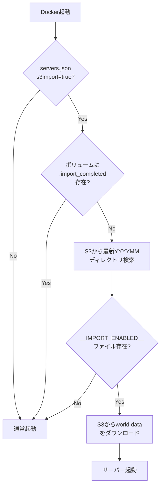

# S3統合機能サマリー

## 実装完了日
2024年12月15日

## 概要

MinecraftサーバーとWeb APIで使用されるデータをS3に保存・取得する機能群を実装しました。

---

## 目次

1. [S3画像マップ管理システム](#1-s3画像マップ管理システム)
2. [S3ワールドデータインポートシステム](#2-s3ワールドデータインポートシステム)
3. [S3バケット構成](#3-s3バケット構成)
4. [IAM権限管理](#4-iam権限管理)
5. [デプロイ手順](#5-デプロイ手順)
6. [トラブルシューティング](#6-トラブルシューティング)

---

## 1. S3画像マップ管理システム

### 1.1 概要

Minecraftプラグインで生成された画像マップをS3に保存・取得する機能。

### 1.2 実装コンポーネント

#### Java実装

| コンポーネント | ファイル | 役割 |
|--------------|---------|------|
| インターフェース | `ImageStorage.java` | ストレージ抽象化 |
| ローカル実装 | `LocalImageStorage.java` | ローカルファイルシステム |
| S3実装 | `S3ImageStorage.java` | S3ストレージ（AWS SDK v2） |
| ストレージ管理 | `ImageStorageManager.java` | ストレージの初期化・管理 |
| 統合 | `ImageMap.java` | プラグインへの統合 |

#### 設定管理

```java
// Settings.java で管理される設定
IMAGE_STORAGE_MODE          // "local" or "s3"
S3_BUCKET_NAME              // kishax-production-image-maps
S3_PREFIX                   // images/
S3_REGION                   // ap-northeast-1
S3_USE_INSTANCE_PROFILE     // true
S3_CACHE_ENABLED            // true
S3_CACHE_DIRECTORY          // /mc/spigot/cache/images
```

### 1.3 S3ディレクトリ構造

```
s3://kishax-production-image-maps/images/
├── 20241215/
│   ├── a1b2c3d4-e5f6-7890-abcd-ef1234567890.png
│   ├── b2c3d4e5-f6g7-8901-bcde-f12345678901.png
│   └── ...
├── 20241216/
│   └── ...
└── 20250112/
    └── ...
```

**命名規則:**
- **形式**: `YYYYMMDD/[UUID].png`
- **YYYYMMDD**: 画像生成日（JST、LocalDate）
- **UUID**: Minecraft内部のマップUUID
- **拡張子**: `.png` 固定

**実装コード:**
```java
// S3ImageStorage.java
private String buildS3Key(String imageUUID, String ext, LocalDate date) {
    String dateStr = date.toString().replace("-", "");
    return prefix + dateStr + "/" + imageUUID + "." + ext;
}
// 例: images/20241215/uuid.png
```

### 1.4 主要機能

#### 非同期処理
- すべてのS3操作は`CompletableFuture`で非同期実行
- ゲームプレイへの影響を最小化

#### ローカルキャッシュ
- S3から取得した画像をローカルにキャッシュ
- 2回目以降のアクセスを高速化
- キャッシュディレクトリ: `/opt/mc/cache/images`

#### フォールバック機能
- S3保存失敗時、自動的にローカルストレージへフォールバック
- 既存のローカル画像もサポート（レガシーパス対応）

### 1.5 デプロイ手順

```bash
# 1. MySQL設定のインポート
make mysql-seed-s3

# 2. キャッシュディレクトリの作成
sudo mkdir -p /opt/mc/cache/images
sudo chown ec2-user:ec2-user /opt/mc/cache/images

# 3. S3モードの有効化（オプション）
mysql -h 127.0.0.1 -P 3307 -u admin -p kishax_mc -e "
UPDATE settings SET value = 's3' WHERE name = 'IMAGE_STORAGE_MODE';
"

# 4. Minecraftサーバーの再起動
cd /opt/mc
docker compose restart

# 5. 動作確認
docker compose logs -f | grep -i "s3\|storage"
aws s3 ls s3://kishax-production-image-maps/images/ --recursive
```

---

## 2. S3ワールドデータインポートシステム

### 2.1 概要

S3に保存されたワールドデータを、サーバー初回起動時に自動的にインポートする機能。

### 2.2 3段階チェックシステム



### 2.3 インポート条件（3段階認証）

#### ① servers.jsonでの設定
```json
{
  "name": "latest",
  "s3import": true,  // ← trueの場合のみインポート対象
  ...
}
```

**現在の設定状況:**
- `home`: `s3import: true` ✅
- `latest`: `s3import: true` ✅
- 他のサーバー: `s3import: false`

#### ② S3での許可フラグ
- `__IMPORT_ENABLED__`ファイルが存在すること（空ファイル）
- 最新の`YYYYMM`ディレクトリ内を検索

#### ③ ローカルボリュームでの初回確認
- `/mc/volumes/{server_name}/.import_completed`が**存在しない**こと
- このファイルが存在する場合、すでにインポート済みと判断

### 2.4 S3ディレクトリ構造

```
s3://kishax-production-world-backups/deployment/
├── 202512/                          # YYYYMM形式のディレクトリ
│   └── 1/                           # バージョン番号
│       ├── latest/                  # サーバー名
│       │   ├── __IMPORT_ENABLED__   # インポート許可フラグ（空ファイル）
│       │   ├── world/               # オーバーワールド
│       │   │   ├── level.dat
│       │   │   ├── region/
│       │   │   └── ...
│       │   ├── world_nether/        # ネザー
│       │   │   └── ...
│       │   └── world_the_end/       # エンド
│       │       └── ...
│       └── home/
│           ├── __IMPORT_ENABLED__
│           └── ...
└── 202601/                          # 新しい月
    └── 1/
        └── latest/
            └── ...
```

### 2.5 実装ファイル

| ファイル | 役割 |
|---------|------|
| `docker/scripts/import-world-from-s3.sh` | S3からダウンロード＆展開 |
| `docker/scripts/start.sh` (281-296行) | 起動時に自動実行 |
| `docker/config/servers.json` | `s3import`フラグ設定 |

**start.shでの自動実行コード:**
```bash
# Check if this server needs S3 world data import
S3IMPORT=$(jq -r ".spigots[$i].s3import // false" "$CONFIG_FILE")

# Import world data from S3 if enabled
if [ "$S3IMPORT" = "true" ]; then
  echo "🌍 S3 import enabled for $SPIGOT_NAME, checking for world data..."
  /mc/scripts/import-world-from-s3.sh "$SPIGOT_NAME" || true
fi
```

### 2.6 使い方

#### 初回インポート
```bash
# 1. S3にワールドデータをアップロード
aws s3 sync ./world/ s3://kishax-production-world-backups/deployment/202512/1/latest/world/
aws s3 sync ./world_nether/ s3://kishax-production-world-backups/deployment/202512/1/latest/world_nether/
aws s3 sync ./world_the_end/ s3://kishax-production-world-backups/deployment/202512/1/latest/world_the_end/

# 2. インポート許可フラグを作成
touch __IMPORT_ENABLED__
aws s3 cp __IMPORT_ENABLED__ s3://kishax-production-world-backups/deployment/202512/1/latest/

# 3. サーバー起動（自動でインポート）
cd /opt/mc
docker compose up -d

# 4. ログ確認
docker compose logs -f | grep -i "s3\|import"
```

#### 強制再インポート
```bash
# フラグを削除
docker exec kishax-minecraft rm /mc/volumes/latest/.import_completed

# 再起動
docker compose restart
```

### 2.7 セキュリティ設計

**2段階認証:**
1. **`s3import: true`** - 開発者がservers.jsonで設定（コード管理）
2. **`__IMPORT_ENABLED__`** - 管理者がS3に配置（運用管理）

**べき等性保証:**
- `.import_completed`フラグで2回目以降のインポートを防止
- 誤って再起動してもワールドデータが上書きされない

---

## 3. S3バケット構成

### 3.1 バケット一覧

| バケット名 | 用途 | ライフサイクル | 備考 |
|-----------|------|---------------|------|
| `kishax-production-docker-images` | Dockerイメージ、ワールドデータ | 30日で自動削除 | 一時的なデータ |
| `kishax-production-image-maps` | 画像マップ | 永続保存 | プレイヤー作成の画像を保持 |
| `kishax-production-world-backups` | ワールドバックアップ、VM展開、移植作業 | バックアップ:180日、移行:90日 | i-aからアクセス可能 |

### 3.2 バケット詳細

#### kishax-production-docker-images
```
s3://kishax-production-docker-images/
├── docker-images/         # Dockerイメージ（tar.gz）
├── worlds/                # ワールドデータ（一時的）
│   └── YYYYMM/
│       └── 1/
│           └── {server_name}/
└── plugins/               # プラグイン（未使用）
```

**ライフサイクルポリシー:**
- 30日経過後に自動削除（Glacier移行なし）

#### kishax-production-image-maps
```
s3://kishax-production-image-maps/
└── images/                # 画像マップ
    └── YYYYMMDD/
        └── {uuid}.png
```

**ライフサイクルポリシー:**
- 永続保存（自動削除なし）
- プレイヤーが作成した画像は削除しない方針

#### kishax-production-world-backups（新規追加）
```
s3://kishax-production-world-backups/
├── backups/               # 定期バックアップ（180日保持）
│   └── YYYYMMDD/
│       └── {server_name}/
│           ├── world/
│           ├── world_nether/
│           └── world_the_end/
├── deployment/            # VM展開用（削除しない）
│   └── {server_name}/
│       └── ...
└── migration/             # 移植作業用（90日保持）
    └── {date}/
        └── ...
```

**ライフサイクルポリシー:**
- `backups/`: 180日経過後に自動削除
- `deployment/`: 永続保存（削除しない）
- `migration/`: 90日経過後に自動削除

**アクセス権限:**
- MCサーバー（i-a）から読み書き可能
- IAMインスタンスプロファイル経由

---

## 4. IAM権限管理

### 4.1 IAMロール

**ロール名:** `kishax-production-ec2-role`

**インスタンスプロファイル:** `kishax-production-ec2-profile`

### 4.2 必要な権限

#### S3画像マップ用
```json
{
  "Effect": "Allow",
  "Action": [
    "s3:GetObject",
    "s3:PutObject",
    "s3:DeleteObject",
    "s3:HeadObject",
    "s3:ListBucket"
  ],
  "Resource": [
    "arn:aws:s3:::kishax-production-image-maps",
    "arn:aws:s3:::kishax-production-image-maps/*"
  ]
}
```

#### S3ワールドバックアップ用
```json
{
  "Effect": "Allow",
  "Action": [
    "s3:GetObject",
    "s3:PutObject",
    "s3:DeleteObject",
    "s3:HeadObject",
    "s3:ListBucket"
  ],
  "Resource": [
    "arn:aws:s3:::kishax-production-world-backups",
    "arn:aws:s3:::kishax-production-world-backups/*"
  ]
}
```

### 4.3 権限確認

```bash
# IAMロールの確認
aws iam get-role --role-name kishax-production-mc-server-role

# EC2インスタンスに適用されているロールの確認
aws ec2 describe-instances --instance-ids i-xxx --query 'Reservations[0].Instances[0].IamInstanceProfile'

# 実際にS3にアクセスできるか確認
aws s3 ls s3://kishax-production-image-maps/
aws s3 ls s3://kishax-production-world-backups/deployment/
aws s3 ls s3://kishax-production-world-backups/backups/
```

---

## 5. デプロイ手順

### 5.1 S3画像マップシステム

```bash
# 1. 別ターミナルでSSMセッション開始
make ssm-mysql

# 2. MySQL設定のインポート
make mysql-seed-s3

# 3. SSH接続してキャッシュディレクトリ作成
make ssh-mc
sudo mkdir -p /opt/mc/cache/images
sudo chown ec2-user:ec2-user /opt/mc/cache/images

# 4. S3モードの有効化（オプション）
make ssh-mysql
UPDATE settings SET value = 's3' WHERE name = 'IMAGE_STORAGE_MODE';
exit

# 5. Minecraftサーバーの再起動
cd /opt/mc
docker compose restart

# 6. 動作確認
docker compose logs -f | grep -i "s3"
```

### 5.2 S3ワールドデータインポート

```bash
# 1. ワールドデータをS3にアップロード（ローカルから）
aws s3 sync ./world/ s3://kishax-production-world-backups/deployment/202512/1/latest/world/ \
  --profile AdministratorAccess-126112056177 \
  --region ap-northeast-1

# 2. インポート許可フラグを作成
touch __IMPORT_ENABLED__
aws s3 cp __IMPORT_ENABLED__ s3://kishax-production-world-backups/deployment/202512/1/latest/ \
  --profile AdministratorAccess-126112056177 \
  --region ap-northeast-1

# 3. EC2でサーバー起動（自動インポート）
make ssh-mc
cd /opt/mc
docker compose up -d

# 4. ログ確認
docker compose logs -f | grep -i "import"
```

---

## 6. トラブルシューティング

### 6.1 S3画像マップ関連

#### S3接続エラー
```bash
# IAMインスタンスプロファイルの確認
aws ec2 describe-instances --instance-ids i-xxx --query 'Reservations[0].Instances[0].IamInstanceProfile'

# IAMロールの権限確認
aws iam get-role-policy --role-name kishax-production-ec2-role --policy-name S3Access

# S3バケットへのアクセス確認
aws s3 ls s3://kishax-production-image-maps/
```

#### キャッシュが動作しない
```bash
# キャッシュディレクトリのパーミッション確認
ls -ld /opt/mc/cache/images

# ディスク容量確認
df -h /opt/mc

# キャッシュディレクトリの中身確認
ls -lah /opt/mc/cache/images/$(date +%Y%m%d)/
```

#### 画像が見つからない
```bash
# S3バケット内のオブジェクト確認
aws s3 ls s3://kishax-production-image-maps/images/ --recursive

# MySQLの画像テーブル確認
mysql -h 127.0.0.1 -P 3307 -u admin -p kishax_mc -e "SELECT * FROM images ORDER BY id DESC LIMIT 10;"

# ローカルキャッシュの確認
find /opt/mc/cache/images -type f -name "*.png" -mtime -1
```

### 6.2 S3ワールドデータインポート関連

#### インポートがスキップされる

**原因① `.import_completed`フラグが存在する**
```bash
# フラグの確認
docker exec kishax-minecraft ls -la /mc/volumes/latest/.import_completed

# フラグの削除（強制再インポート）
docker exec kishax-minecraft rm /mc/volumes/latest/.import_completed
docker compose restart
```

**原因② `__IMPORT_ENABLED__`フラグがS3に存在しない**
```bash
# S3のフラグを確認
aws s3 ls s3://kishax-production-world-backups/deployment/ --recursive | grep '__IMPORT_ENABLED__'

# フラグを作成
touch __IMPORT_ENABLED__
aws s3 cp __IMPORT_ENABLED__ s3://kishax-production-world-backups/deployment/202512/1/latest/
```

**原因③ `servers.json`で`s3import: false`になっている**
```bash
# 設定確認
docker exec kishax-minecraft cat /mc/config/servers.json | grep -A 5 '"latest"'

# 設定を修正（ローカル環境）
vi apps/mc/docker/config/servers.json
# "s3import": true に変更

# デプロイ
cd /opt/mc
docker compose down
docker compose up -d
```

#### S3アクセスエラー
```bash
# IAM権限確認（ローカルから）
aws s3 ls s3://kishax-production-world-backups/deployment/ \
  --profile AdministratorAccess-126112056177

# EC2インスタンスからのアクセス確認
make ssh-mc
aws s3 ls s3://kishax-production-world-backups/deployment/
```

#### ワールドデータが破損している
```bash
# S3のワールドデータ確認
aws s3 ls s3://kishax-production-world-backups/deployment/202512/1/latest/world/ --recursive

# ダウンロードして確認
aws s3 sync s3://kishax-production-world-backups/deployment/202512/1/latest/world/ /tmp/world-check/

# level.datの確認
file /tmp/world-check/level.dat
```

---

## 7. モニタリング

### 7.1 S3メトリクス

```bash
# S3バケットのオブジェクト数
aws s3 ls s3://kishax-production-image-maps/images/ --recursive | wc -l
aws s3 ls s3://kishax-production-world-backups/deployment/ --recursive | wc -l
aws s3 ls s3://kishax-production-world-backups/backups/ --recursive | wc -l

# S3バケットのサイズ
aws s3 ls s3://kishax-production-image-maps/ --recursive --summarize --human-readable
aws s3 ls s3://kishax-production-world-backups/ --recursive --summarize --human-readable
```

### 7.2 アプリケーションログ

```bash
# S3関連のログを監視
docker compose logs -f | grep -i "s3\|storage\|import"

# 画像マップのログ
docker compose logs -f | grep -i "ImageStorage\|ImageMap"

# ワールドインポートのログ
docker compose logs -f | grep -i "import-world-from-s3"
```

---

## 8. 今後の拡張

### 8.1 S3画像マップ

- [ ] S3ライフサイクルポリシーで古い画像の自動削除
- [ ] LRUキャッシュの実装
- [ ] CloudWatch Logsへのログ転送
- [ ] 既存ローカル画像のS3への一括アップロードツール

### 8.2 S3ワールドデータ

- [ ] バージョン番号を環境変数で指定可能に
- [ ] インポート進捗をログに出力
- [ ] インポート完了後にDiscord通知
- [ ] ワールドデータの自動バックアップ（逆方向のS3アップロード）
- [ ] 差分バックアップの実装（rsyncベース）

### 8.3 共通

- [ ] S3操作のメトリクス収集（CloudWatch）
- [ ] S3コスト最適化（Intelligent-Tiering）
- [ ] マルチリージョン対応

---

## 9. 参考資料

### ドキュメント
- [S3_IMAGE_STORAGE.md](../../apps/mc/docker/docs/S3_IMAGE_STORAGE.md) - 画像マップ詳細設計
- [S3_WORLD_IMPORT.md](../../apps/mc/docker/docs/S3_WORLD_IMPORT.md) - ワールドインポート詳細設計
- [deployment.md](./deployment.md) - デプロイ手順

### AWS公式
- [AWS SDK for Java v2 Documentation](https://docs.aws.amazon.com/sdk-for-java/latest/developer-guide/home.html)
- [S3 Lifecycle Configuration](https://docs.aws.amazon.com/AmazonS3/latest/userguide/object-lifecycle-mgmt.html)
- [IAM Roles for EC2](https://docs.aws.amazon.com/AWSEC2/latest/UserGuide/iam-roles-for-amazon-ec2.html)

### 関連コード
- `apps/mc/spigot/svcore/src/main/java/net/kishax/mc/spigot/server/imagemap/` - 画像マップJava実装
- `apps/mc/docker/scripts/import-world-from-s3.sh` - ワールドインポートスクリプト
- `terraform/modules/s3/main.tf` - S3バケットTerraform定義
- `terraform/modules/iam/main.tf` - IAMロール定義

---

## 10. チェックリスト

### デプロイ前チェック

#### S3画像マップ
- [ ] S3バケット `kishax-production-image-maps` が存在する
- [ ] IAMロールに必要な権限が付与されている
- [ ] MySQL設定がインポートされている
- [ ] キャッシュディレクトリが作成されている

#### S3ワールドデータ
- [ ] S3バケット `kishax-production-docker-images` が存在する
- [ ] ワールドデータがS3にアップロードされている
- [ ] `__IMPORT_ENABLED__` フラグが配置されている
- [ ] `servers.json` で `s3import: true` が設定されている

### デプロイ後確認

#### S3画像マップ
- [ ] `docker compose logs` でS3クライアント初期化を確認
- [ ] 画像マップ作成コマンドが正常に動作する
- [ ] S3バケットに画像がアップロードされている
- [ ] ローカルキャッシュに画像が保存されている

#### S3ワールドデータ
- [ ] 起動ログにインポート処理が表示されている
- [ ] ワールドデータが正常にロードされている
- [ ] `.import_completed` フラグが作成されている
- [ ] 再起動してもインポートがスキップされる

---

**最終更新:** 2024年12月15日

