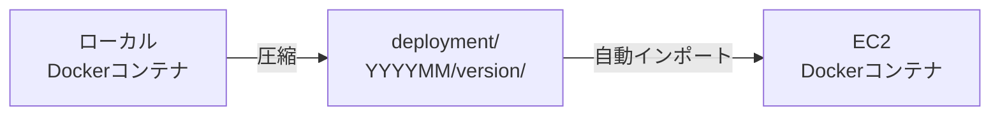
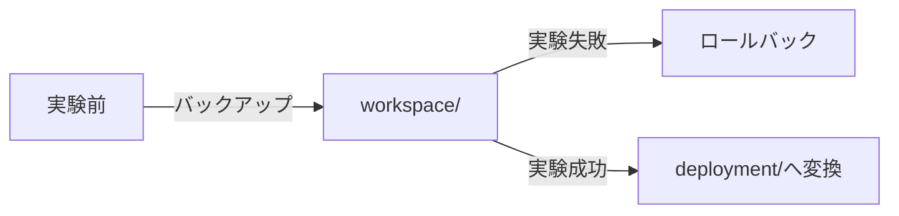
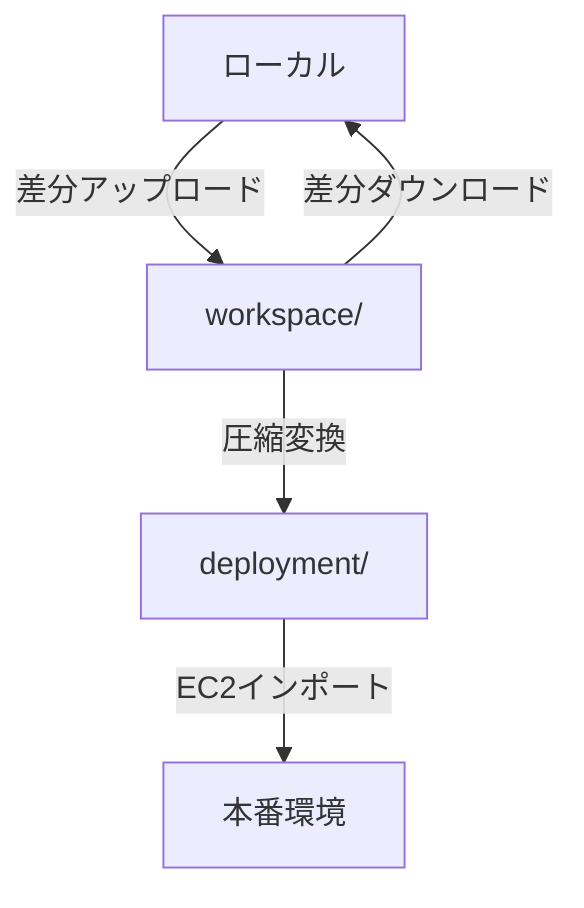

# Minecraft World S3アーキテクチャ

**作成日**: 2026-01-04
**バージョン**: 2.0.0
**対象環境**: Production (ap-northeast-1)

---

## 📋 目次

1. [概要](#概要)
2. [S3バケット構造](#s3バケット構造)
3. [3つのパスの使い分け](#3つのパスの使い分け)
4. [ワークフロー](#ワークフロー)
5. [スクリプト一覧](#スクリプト一覧)
6. [Makefileコマンド一覧](#makefileコマンド一覧)

---

## 概要

MinecraftワールドデータをS3で管理するための統合アーキテクチャです。

### 設計思想

- **圧縮による転送効率化**: 膨大なワールドデータを圧縮して転送時間を短縮
- **用途別の最適化**: deployment（本番）、workspace（実験）で異なる形式を使用
- **差分同期による高速化**: workspaceでは非圧縮+差分同期で実験を高速化

---

## S3バケット構造

すべて `s3://kishax-production-world-backups/` 配下に配置されます。

```
s3://kishax-production-world-backups/
│
├── deployment/          # 本番デプロイメント用（圧縮）
│   └── YYYYMM/          # 年月（例: 202601）
│       └── [version]/   # バージョン番号（例: 1, 2, 3...）
│           └── [server]/  # サーバー名（例: home, latest）
│               ├── world.tar.gz
│               ├── world_nether.tar.gz
│               ├── world_the_end.tar.gz
│               ├── world_the_creative.tar.gz  # latestサーバー独自
│               ├── metadata.json
│               └── __IMPORT_ENABLED__
│
└── workspace/           # 実験用作業スペース（非圧縮）
    └── [server]/        # サーバー名のみ（バージョニングなし）
        ├── world/
        │   ├── level.dat
        │   ├── region/
        │   └── ...
        ├── world_nether/
        ├── world_the_end/
        ├── world_the_creative/  # latestサーバー独自
        └── metadata.json
```

### 廃止されたパス

- ~~`backups/`~~ - 廃止（deploymentに統合）

---

## 3つのパスの使い分け

| パス | 形式 | 用途 | ライフサイクル | バージョニング |
|------|------|------|--------------|--------------|
| **deployment/** | 圧縮 (tar.gz) | 本番デプロイ・EC2自動インポート | 永続保存 | YYYYMM/version |
| **workspace/** | 非圧縮 | 実験前の一時バックアップ | 手動管理 | なし（1世代のみ） |

### deployment/ - 本番デプロイメント用

**用途**: EC2初回起動時の自動インポート

**特徴**:
- ✅ **圧縮**: tar.gz形式でストレージコスト削減
- ✅ **永続保存**: ライフサイクルポリシーなし（自動削除されない）
- ✅ **バージョン管理**: YYYYMM + バージョン番号で履歴管理
- ✅ **自動インポート**: `__IMPORT_ENABLED__` フラグで制御

**アップロード方法**:
```bash
# 直接アップロード（圧縮形式）
make deploy-world

# または、workspaceから変換
make workspace-to-deployment
```

### workspace/ - 実験用作業スペース

**用途**:
- 実験的な変更前の一時バックアップ
- 差分同期による高速転送（`aws s3 sync`）
- 手動管理（バージョニングなし、手動削除）

**特徴**:
- ✅ **非圧縮**: ファイルそのままで保存（高速差分同期）
- ✅ **差分のみ転送**: `aws s3 sync` で変更ファイルのみアップロード
- ✅ **バージョニングなし**: 常に最新の1世代のみ
- ✅ **手動管理**: 不要になったら手動削除

**アップロード方法**:
```bash
# 非圧縮で差分のみアップロード
make workspace-upload
```

---

## ワークフロー

### ワークフロー1: 本番デプロイ



```bash
# ローカル → S3 deployment/
make deploy-world

# EC2でDockerコンテナ起動時に自動インポート
# (servers.jsonでs3import: trueに設定)
```

### ワークフロー2: 実験的な変更



```bash
# 1. 実験前にバックアップ
make workspace-upload

# 2a. 実験失敗 → ロールバック
make workspace-download
make restart-all

# 2b. 実験成功 → deploymentへ変換
make workspace-to-deployment
```

### ワークフロー3: workspaceの活用



```bash
# workspace活用例
make workspace-upload          # 非圧縮で差分アップロード
make workspace-download        # 非圧縮で差分ダウンロード
make workspace-to-deployment   # workspaceをdeploymentへ変換
make workspace-list            # workspace一覧確認
make workspace-clean SERVER=home  # workspace削除
```

---

## スクリプト一覧

### deployment/ 関連

| スクリプト | 機能 | 形式 |
|-----------|------|------|
| [deploy-world-to-s3.sh](../../apps/mc/docker/scripts/deploy-world-to-s3.sh) | ワールドを圧縮してdeployment/へアップロード | 圧縮 |
| [import-world-from-s3.sh](../../apps/mc/docker/scripts/import-world-from-s3.sh) | deployment/から圧縮ファイルをダウンロード・解凍 | 圧縮 |

### workspace/ 関連

| スクリプト | 機能 | 形式 |
|-----------|------|------|
| [sync-world-to-workspace.sh](../../apps/mc/docker/scripts/sync-world-to-workspace.sh) | ワールドをworkspace/へ非圧縮同期（アップロード） | 非圧縮 |
| [sync-world-from-workspace.sh](../../apps/mc/docker/scripts/sync-world-from-workspace.sh) | workspace/からワールドを非圧縮同期（ダウンロード） | 非圧縮 |
| [create-deployment-from-workspace.sh](../../apps/mc/docker/scripts/create-deployment-from-workspace.sh) | workspace/をdeployment/へ変換（圧縮） | 変換 |

### 共通オプション

すべてのスクリプトは以下のオプションに対応：

```bash
--dry-run                # 実際には実行せず確認のみ
--server <name>          # 特定サーバーのみ処理
--help                   # ヘルプ表示
```

### deployment/スクリプトの追加オプション

```bash
--version <num>          # バージョン番号指定（自動採番の代わり）
--compression <1-9>      # 圧縮レベル（デフォルト: 6）
```

---

## Makefileコマンド一覧

### deployment/ 関連コマンド

| コマンド | 説明 | 実行場所 |
|---------|------|---------|
| `make deploy-world` | ワールドデータを圧縮してdeployment/へアップロード | EC2 i-a |
| `make deploy-world-list` | deployment/一覧を表示 | EC2 i-a |

### workspace/ 関連コマンド

| コマンド | 説明 | 実行場所 |
|---------|------|---------|
| `make workspace-upload` | ワールドをworkspace/へ非圧縮同期（アップロード） | EC2 i-a |
| `make workspace-download` | workspace/からワールドを非圧縮同期（ダウンロード） | EC2 i-a |
| `make workspace-to-deployment` | workspace/をdeployment/へ変換 | EC2 i-a |
| `make workspace-list` | workspace/一覧を表示 | EC2 i-a |
| `make workspace-clean SERVER=<name>` | workspace/の特定サーバーを削除 | EC2 i-a |

---

## 使用例

### 例1: 本番デプロイ

```bash
# EC2 i-a で実行
cd /opt/mc

# ワールドデータをdeployment/へアップロード（圧縮）
make deploy-world

# 実行内容：
# - ワールドをtar.gz圧縮
# - deployment/202601/1/home/ へアップロード
# - deployment/202601/1/latest/ へアップロード
```

### 例2: 実験的な変更

```bash
# 1. 実験前にworkspaceへバックアップ
make workspace-upload

# 2. 実験を実施（ワールドに破壊的な変更）
# ... 実験 ...

# 3a. 実験失敗！ロールバック
make workspace-download
make restart-all

# 3b. 実験成功！deploymentへ保存
make workspace-to-deployment
```

### 例3: workspaceの差分同期

```bash
# 定期的にworkspaceへバックアップ（差分のみ転送）
make workspace-upload

# 何度実行しても差分のみ転送されるため高速
# 例：2回目以降は変更ファイルのみアップロード
```

---

## 技術詳細

### 圧縮形式

- **圧縮コマンド**: `tar -cf archive.tar.gz -C /path world --use-compress-program="gzip -6"`
- **圧縮レベル**: デフォルト6（1=速い/大きい、9=遅い/小さい）
- **展開コマンド**: `tar -xzf archive.tar.gz -C /dest`

### 動的ワールド検出

すべてのスクリプトは `world*` パターンで動的検出：

```bash
find "$server_dir" -maxdepth 1 -type d -name "world*" -print0 | sort -z
```

これにより以下のワールドが自動的に処理されます：
- `world` (オーバーワールド)
- `world_nether` (ネザー)
- `world_the_end` (ジ・エンド)
- `world_the_creative` (latestサーバー独自ワールド)
- その他の`world*`ワールド（将来追加されても自動対応）

### メタデータ

各デプロイメント/workspaceには`metadata.json`が含まれます：

```json
{
  "server": "latest",
  "year_month": "202601",
  "version": "1",
  "timestamp": "2026-01-04T12:00:00Z",
  "compression_level": 6,
  "total_size_bytes": 1234567890,
  "worlds": [
    {
      "world": "world",
      "archive": "world.tar.gz",
      "size_bytes": 500000000
    },
    {
      "world": "world_the_creative",
      "archive": "world_the_creative.tar.gz",
      "size_bytes": 300000000
    }
  ]
}
```

---

## トラブルシューティング

### deployment/へのアップロードが遅い

**原因**: ワールドデータが膨大で圧縮に時間がかかる

**解決策**:
```bash
# 圧縮レベルを下げる（速度優先）
docker exec -it kishax-minecraft /mc/scripts/deploy-world-to-s3.sh --compression 1
```

### workspaceからの復元が失敗する

**原因**: workspace/が存在しない

**確認**:
```bash
make workspace-list
```

**解決策**:
```bash
# まずworkspaceへアップロード
make workspace-upload
```

### 特定サーバーのみ処理したい

**解決策**:
```bash
# deploymentへのアップロード（homeサーバーのみ）
docker exec -it kishax-minecraft /mc/scripts/deploy-world-to-s3.sh --server home

# workspaceへのアップロード（latestサーバーのみ）
docker exec -it kishax-minecraft /mc/scripts/sync-world-to-workspace.sh --server latest
```

---

## 関連ドキュメント

- [デプロイメント手順書](./deployment.md)
- [S3基本操作](./s3-basic-operations.md)
- [S3機能サマリ](./s3-features-summary.md)
