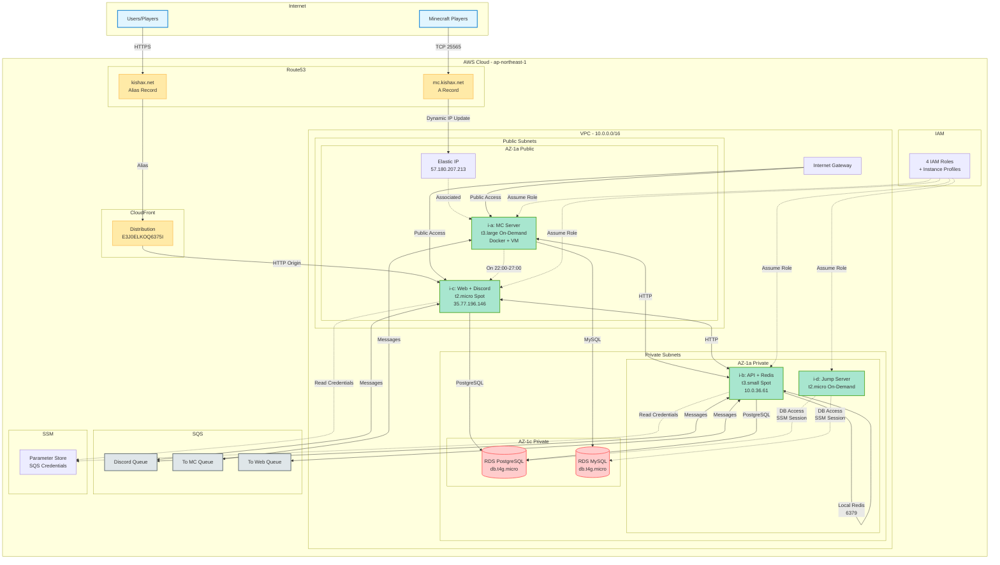

# Kishax New Infrastructure Architecture (EC2-based)

## Architecture Summary

### Network Architecture
- **VPC**: 10.0.0.0/16
- **Public Subnets**: 2 AZs (i-a MC Server, i-c Web Server)
- **Private Subnets**: 2 AZs (i-b API Server, i-d Jump Server, RDS instances)

### Compute Resources
1. **i-a (MC Server)**: t3.large On-Demand, 22:00-27:00 operation, Elastic IP 57.180.207.213
2. **i-b (API + Redis)**: t3.small Spot, 24/7 operation, Private IP 10.0.36.61
3. **i-c (Web + Discord)**: t2.micro Spot, 24/7 operation, Public IP 35.77.196.146
4. **i-d (Jump Server)**: t2.micro On-Demand, On-demand access only

### Database
- **RDS PostgreSQL**: db.t4g.micro (Web, API, Discord Bot)
- **RDS MySQL**: db.t4g.micro (Minecraft server data)

### Content Delivery
- **CloudFront**: Distribution E3J0ELKOQ6375I for `kishax.net`
- **Route53**: DNS records for `mc.kishax.net` and `kishax.net`

### Message Queuing
- **SQS Discord Queue**: Inter-service communication
- **SQS To MC Queue**: Messages to Minecraft server
- **SQS To Web Queue**: Messages to web application

### Security & Access
- **4 IAM Roles**: Least-privilege per EC2 instance
- **5 Security Groups**: Granular network access control
- **SSM Session Manager**: Secure access to Jump Server
- **SSM Parameter Store**: SQS credentials storage

### Cost Optimization
- Spot instances for stateless services (i-b, i-c)
- On-Demand for critical data (i-a, i-d)
- Single-AZ RDS deployment
- Redis on EC2 instead of ElastiCache
- **Target Cost**: ~$45.6/month (~¥6,900)
